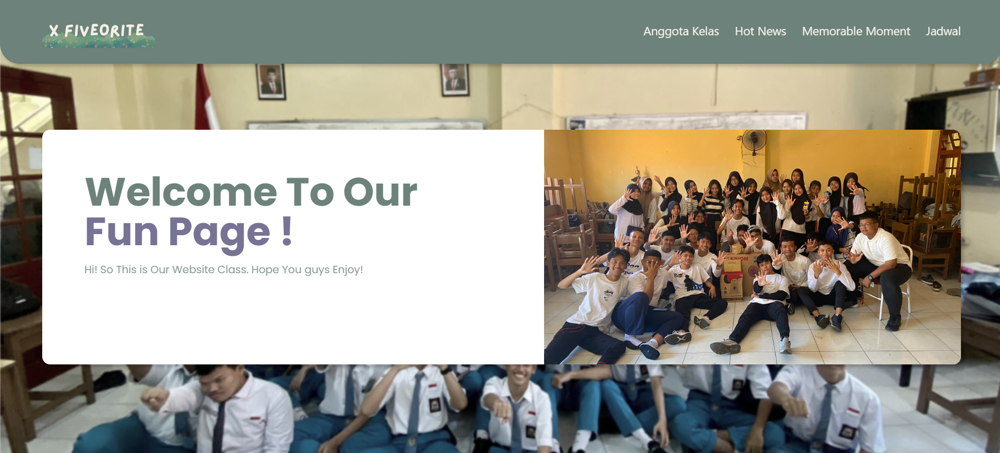

# 🔥 X-Five Slekoors



The official website for X-Five Slekoors. This project is fully animated to ensure the UI feels dynamic and engaging.

## Live Demo
No need to run this locally! You can view the live site right here: 
**[https://mjawadb.github.io/xfiveslekoors/](https://mjawadb.github.io/xfiveslekoors/)**

## Tech Stack
Built within the React ecosystem, utilizing several libraries for styling and animation:
- React.js 
- Tailwind CSS
- Framer Motion, Anime.js, AOS, & React Reveal (for animations)
- Swiper (for carousels)

## Running Locally
If you want to clone and run it yourself:

1. Make sure you have Node.js installed.
2. Clone this repository.
3. Run `npm install` in your terminal to fetch all dependencies.
4. Run `npm start`.
5. Open `http://localhost:3000` in your browser.

## Build
To build for production:
```bash
npm run build
```
